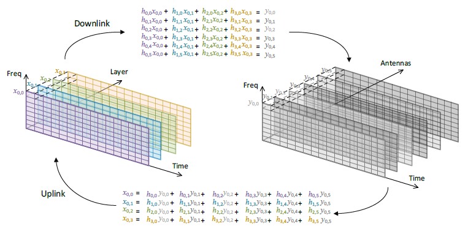
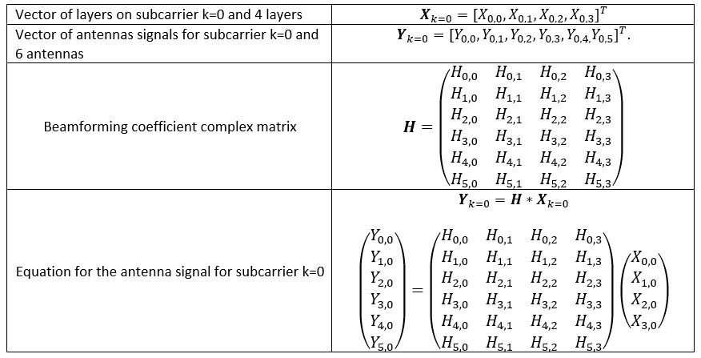
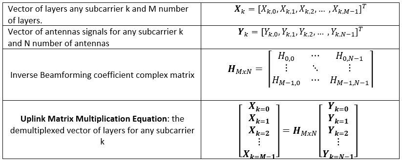

<table class="sphinxhide" width="100%">
 <tr width="100%">
    <td align="center"><h1>AI Engine Development</h1>
    <a href="https://www.xilinx.com/products/design-tools/vitis.html">See Vitis™ Development Environment on xilinx.com</br></a>
    <a href="https://www.xilinx.com/products/design-tools/vitis/vitis-ai.html">See Vitis™ AI Development Environment on xilinx.com</a>
    </td>
 </tr>
</table>

# Beamforming Tutorial

***Version: Vitis 2022.2***

## Introduction

The Versal® adaptive compute acceleration platform (ACAP) is a fully software programmable, heterogeneous compute platform that combines the processing system (PS) (Scalar Engines that include Arm™ processors), programmable logic (PL) (Adaptable Engines that include the programmable logic), and AI Engines which belong in the Intelligent Engine category.

This tutorial demonstrates the creation of a beamforming system running on the AI Engine, PL, and PS, and the validation of the design running on this heterogeneous domain.

The tutorial has been divided into modules. It takes you through creating a custom embedded platform, a bare-metal host application, and a custom PetaLinux-based Linux host application, as well as hardware emulation and hardware build flows in the context of a complete Versal ACAP system integration. Each module uses a Makefile to build the relevant aspect of the design.

### Tutorial Overview

This beamforming tutorial is a system-level design that uses the AI Engine, PL, and PS resources. This design showcases the following features:

* A high utilization of PL and AI Engine resources which require advanced timing closure techniques
* Custom platform creation
* An AI Engine graph that implements matrix multiplication functions for uplink and downlink beamforming
* RTL kernels that interface with the AI Engine and operate at 400 MHz
* A scalable architecture that only needs a small number of kernels to be developed and can be copied multiple times to extend compute power
* Bare-metal and PetaLinux PS host application development process
* Timing closure methods for a high utilization design
* Hardware emulation and VCK190 board flows
* A hierarchical Makefile structure to highlight dependencies between build steps and showcase a way for multiple developers to work on the same repository at the same time (AI Engine developers, RTL designers, and software developers)

#### Assumptions

To fully grasp the design, it is assumed that you have the following knowledge and resources:

* Ability to read Tcl scripts
* Ability to read C++ based source code to understand the AI Engine kernels and host application source code (bare metal and Linux)
* Ability to read Verilog RTL to understand the Vivado® projects created for the RTL PL kernels
* A base bootable design (that is to say, you have brought up your board, and have a working hardware and board through a simple Vivado design)

## Before You Begin

This tutorial targets the [VCK190 ES board](https://www.xilinx.com/products/boards-and-kits/vck190.html). This board is currently available through early access. If you have already purchased this board, download the necessary files from the lounge and ensure you have the correct licenses installed. If you do not have a board and ES license, get in touch with your Xilinx sales contact.

### *Documentation*: Explore AI Engine Architecture

* [AM009 AI Engine Architecture Manual](https://www.xilinx.com/support/documentation/architecture-manuals/am009-versal-ai-engine.pdf)

* [Versal ACAP AI Engines for Dummies](https://forums.xilinx.com/t5/Design-and-Debug-Techniques-Blog/Versal-ACAP-AI-Engines-for-Dummies/ba-p/1132493)

* [AI Engine Tools lounge](https://www.xilinx.com/member/versal_ai_tools_ea.html)

* [AI Engine Documentation](https://www.xilinx.com/html_docs/xilinx2021_1/vitis_doc/yii1603912637443.html)


### *Tools*: Installing the Tools

1. Obtain a license to enable beta devices in Xilinx tools (to use the VCK190 platform).
2. Obtain licenses for AI Engine tools.
3. Follow the instructions in [Installing Xilinx Runtime and Platforms](https://www.xilinx.com/html_docs/xilinx2021_1/vitis_doc/acceleration_installation.html#dhg1543555360045__ae364401) (XRT).
4. Follow the instructions to install PetaLinux tools in the PetaLinux Tools Documentation ([UG1144](https://www.xilinx.com/content/dam/xilinx/support/documentation/sw_manuals/xilinx2021_2/ug1144-petalinux-tools-reference-guide.pdf)).
5. Download the VCK190 PetaLinux 2022.2 BSP from the [Versal AI Core Series VCK190 HeadStart Early Access Site
](https://www.xilinx.com/member/vck190_headstart.html#docs).

To build and run the Beamforming tutorial, you will also need to have downloaded and installed the following tools:

* [Vitis™ Unified Software Development Platform 2021.2](https://www.xilinx.com/html_docs/xilinx2021_2/vitis_doc/acceleration_installation.html#juk1557377661419)
* [The Xilinx RunTime (XRT)](https://docs.xilinx.com/r/en-US/ug1393-vitis-application-acceleration/Installing-Xilinx-Runtime-and-Platforms)
* [PetaLinux Tools](https://www.xilinx.com/support/download/index.html/content/xilinx/en/downloadNav/embedded-design-tools.html)

### *Environment*: Setting Up Your Shell Environment

When the elements of the Vitis software platform are installed, update the shell environment script. Set the necessary environment variables to your system specific paths.

1. Edit the `env_setup.sh` script with your file paths:

```bash
export PATH_TO_BSP=<path-to-bsps> #(the folder that contains xilinx-vck190-v2022.2-final.bsp)

source <XILINX-INSTALL-LOCATION>/Vitis/2022.2/settings64.sh
source <path-to-installed-PetaLinux>/settings.sh
```
2. Source the environment script in bash shell:

To get bash shell, use the below command

```bash
export SHELL=/bin/bash
echo $SHELL
```
Source the environment script

```bash
source env_setup.sh
```  

### *Validation*: Confirming Tool Installation

Make sure you are using the 2022.2 version of the Xilinx tools.

```bash
which vitis
which aiecompiler
```

### *Other Tutorials*: Learn Basic V++ and AI Engine Concepts

If you are a novice user, review the following tutorials to understand the basic Vitis compiler concepts and how to  build simple AI Engine designs:

* [XD002: AI Engine Versal Integration for Hardware Emulation and Hardware](https://github.com/Xilinx/Vitis-In-Depth-Tutorial/tree/master/AI_Engine_Development/Feature_Tutorials/05-AI-engine-versal-integration)

* [XD004: Versal System Design Clocking](https://github.com/Xilinx/Vitis-In-Depth-Tutorial/tree/master/AI_Engine_Development/Feature_Tutorials/06-versal-system-design-clocking-tutorial)

### System Design Overview

This tutorial showcases a beamforming system with 32 layers and 64 antennas implemented on an XCVC1902 Versal ACAP device in the VCK190 board. The beamforming system consists of a downlink subsystem which contains the DL64A32L AI Engine subgraph and the ``dlbf_data``, ``dlbf_coeff``, and ``dlbf_slave`` PL RTL kernels. The beamforming system also consists of the uplink subsystem, which contains the UL64A32L AI Engine subgraph and the ``ulbf_data``, ``ulbf_coeff``, and ``ulbf_slave`` PL RTL kernels. Together, the downlink and uplink subsystems implement the uplink and downlink matrix multiplication equations for M=32 layers and N=64 antennas and compute sample data. The results are compared to reference downlink and uplink result data for verification. The entire beamforming system is copied three times to make full use of the available AI Engine and PL resources.

#### Block Diagram


## Modules

### Module 01 - Custom Platform

The module shows when to create a custom platform rather than a base platform. It also shows how to create a custom platform, using a beamforming platform as an example.

[Read more ...](Module_01_Custom_Platform)

### Module 02 - AI Engine Design

* Teaches AI Engine developers how to:

  * Map beamforming functions to AI Engine kernels.
  * Design AI Engine graphs with beamforming source code as example.
  * Use the AI Engine compilers (and understand why unique options are used for this design).
  * Use the AI Simulator to test against reference output data.

[Read more...](Module_02_AI_Engine_Design)

### Module 03 - PL Design

This module shows RTL designers how to:

  * Map data storage and data capture functions to Custom RTL PL kernels which will connect to the AI Engine and custom platform.
  * Design PL kernels with the beamforming PL source RTL as an example.
  * Package RTL PL kernels in to XO files.

[Read more...](Module_03_PL_Design)

### Module 04 - AI Engine and PL Integration

This module shows developers how to:

 * Combine an AI Engine graph (``libadf.a``) and ``*.xo`` PL kernels into an XCLBIN.
 * Guide the Vivado tool to close timing on a high utilization design.

[Read more...](Module_04_AI_Engine_and_PL_Integration)

### Module 05 - Bare-Metal PS Host Application

This module shows software developers how to create a bare-metal application for beamforming.

[Read more...](Module_05_Baremetal_Host_Application)

### Module 06 - System Integration - Bare Metal

This module shows developers how to:

  * Package their design using the Vitis compiler for hardware or hardware emulation.
  * Run hardware emulation.
  * Run their bare metal design on hardware (VCK190 board).

[Read more...](Module_06_Running_the_Baremetal_System)

### Module 07 - PetaLinux

This module shows developers how to:

  * Build a custom PetaLinux software platform.
  * Package the linked XSA and custom Petalinux software platform into a new Versal Custom Platform (``.xpfm``).

[Read more...](Module_07_Petalinux)

### Module 08 - Linux SW Application

This module shows developers how to create a Linux PS host application for functional and performance tests.

[Read more...](Module_08_Linux_SW_Application)

### Module 09 - System Integration - Linux

This module shows developers how to:

* Package their design using the Vitis compiler for a hardware run with a Linux PS host application.
* Run their design on hardware (VCK190 board).

[Read more...](Module_09_Running_the_Linux_System)

### Beamforming Introduction

This tutorial shows efficient implementation of beamforming functionality on AI Engine arrays in the Xilinx Versal AI Engine devices. The design methodology is applicable to many use cases needing high throughput matrix multiplication, such as 5G wireless communication. The following figure shows an example illustration of how matrix multiplication is used in the beamforming of an orthogonal frequency division multiplex (OFDM) system with four layers and six antennas.



#### Downlink Beamforming

A single symbol of an OFDM system contains a frequency component and time component allocated to a single user (X<sub>0,0</sub>). Multiple symbols in different layers of an OFDM system (X<sub>0,0</sub>,X<sub>0,1</sub>,X<sub>0,2</sub>,X<sub>0,3</sub>) are multiplied by a specific set of complex weights (H<sub>0,0</sub>,H<sub>1,0</sub>,H<sub>2,0</sub>,H<sub>3,0</sub>) so the data between layers becomes “orthogonal” to each other. This orthogonality allows the layers to be summed together into a single signal (Y<sub>0,0</sub>) which is sent to an antenna. A second antenna signal (X<sub>0,1</sub>) can be created by multiplying another set of weights (H<sub>0,1</sub>,H<sub>1,1</sub>,H<sub>2,1</sub>,H<sub>3,1</sub>) to each layer (X<sub>0,0</sub>,X<sub>0,1</sub>,X<sub>0,2</sub>,X<sub>0,3</sub>). The same is done to create the rest of the antenna signals (Y<sub>0,2</sub>,Y<sub>0,3</sub>,Y<sub>0,4</sub>, and Y<sub>0,5</sub>).

##### Downlink Beamforming Formulation

The example and generalized downlink matrix multiplication formulas are given below.

###### Example Equations for a Single Subcarrier



###### Generalized Downlink Beamforming Equations


#### Uplink Beamforming

At the receiving end, the antenna data (Y<sub>0,0</sub>-Y<sub>0,5</sub>) can be demultiplexed back into their original layers (X<sub>0,0</sub>-Y<sub>0,3</sub>) because of their orthogonal feature.   

###### Generalized Uplink Beamforming Equations



# Support

GitHub issues will be used for tracking requests and bugs. For questions go to [forums.xilinx.com](http://forums.xilinx.com/).

# License

Licensed under the Apache License, Version 2.0 (the "License"); you may not use this file except in compliance with the License.

You may obtain a copy of the License at [http://www.apache.org/licenses/LICENSE-2.0]( http://www.apache.org/licenses/LICENSE-2.0 )


Unless required by applicable law or agreed to in writing, software distributed under the License is distributed on an "AS IS" BASIS, WITHOUT WARRANTIES OR CONDITIONS OF ANY KIND, either express or implied. See the License for the specific language governing permissions and limitations under the License.

<p align="center"> XD016 | &copy; Copyright 2020–2021 Xilinx, Inc.</p
