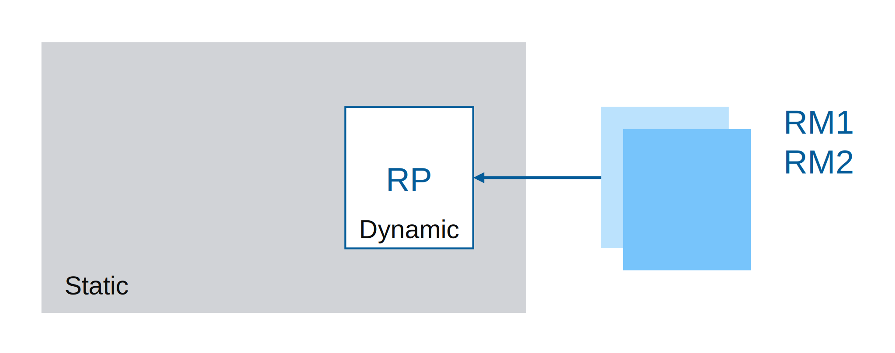
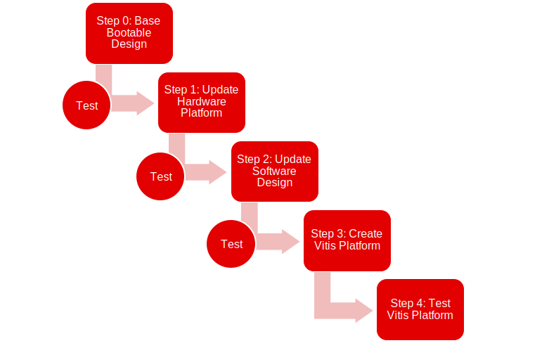

<!-- 
# Copyright 2021 Xilinx Inc.
# 
# Licensed under the Apache License, Version 2.0 (the "License");
# you may not use this file except in compliance with the License.
# You may obtain a copy of the License at
#
#     http://www.apache.org/licenses/LICENSE-2.0
#
# Unless required by applicable law or agreed to in writing, software
# distributed under the License is distributed on an "AS IS" BASIS,
# WITHOUT WARRANTIES OR CONDITIONS OF ANY KIND, either express or implied.
# See the License for the specific language governing permissions and
# limitations under the License.
-->

<table class="sphinxhide" width="100%">
 <tr width="100%">
    <td align="center"><h1>Vitis™ Platform Creation Tutorials</h1>
    <a href="https://www.xilinx.com/products/design-tools/vitis.html">See Vitis™ Development Environment on xilinx.com </a>
    </td>
 </tr>
</table>

# Versal Custom DFX Platform Creation Tutorial

***Version: 2022.2***

In this module, we will create a custom DFX platform to run acceleration applications for VCK190 evaluation board. 

DFX means Dynamic Function eXchange. Platforms that support DFX feature allows user to reload acceleration kernels during runtime. 

User can define one reconfugurable partition (RP) region and create multiple reconfigurable modules (RM). The RP defines the boundary between reconfiguable region and static region. The RM defines the content to be reconfigured each time. The RP can include Programmable Logic and AI Engine resources. User can reconfigure the RM (rm1.xclbin, rm2.xclbin, etc.) during run time with XRT. The AI Engine needs to be fully reconfigured or not at all. Multi-parition AI Engine and PL DFX is not supported in this version.

This tutorial assumes the readers understand the basics of Versal Custom Platform creation steps, e.g. creating Vivado design from Vivado Customizable Example Design template, setup software components with common images or PetaLinux, creating Vitis platforms, and creating basic acceleration applications for platform validation. This tutorial will focus on the differences between the DFX platforms and the normal flat platforms. 

In a general Vitis acceleration platform design, we start from building a base bootable design, then add platform required components and properties to it. We need to validate each step before going to the next step to prevent error prograting. This workflow is described in the following diagram.

In this tutorial, we will utilize the Vivado Versal DFX customizable example design to create the hardware design.

To prepare the software components, we will utilize common image released by Xilinx and `createdts` command to generate Device tree file.

After the whole software and hardware components are ready, we'll package the platform. 

In each step, we'll test the generated files to make sure they work as expected. A frequent test methodology can help to narrow down the root causes if any error occurs. At last, we'll run several test applications on this platform to test this customized platform.

Please navigate through these steps with the following table of contents links.

- [Step 1: Hardware Settings for Vitis Platform](./step1.md)
- [Step 2: Create the Software Components and Generate Platform](./step2.md)
- [Step 3: Test the Platform](./step3.md)
- [Frequently Asked Questions](faq.md)

## Requirements and assumptions

This tutorial design uses VCK190 production board for demonstration. The methdology works for all boards.

This design requires a Linux host machine with Internet access. The Linux OS needs to support the Vitis software and PetaLinux.

We assume the readers of this tutorial are familiar with Vitis platform creation flow. If not, please refer to VCK190 Platform Creation Tutorial and UG1393: Vitis Acceleration Flow User Guide for more information.

## What's Next

Let's start with [Step 1](./step1.md).

## Reference

- [UG1393: Vitis Acceleration Flow User Guide](https://www.xilinx.com/html_docs/xilinx2022_1/vitis_doc/index.html)
   - [Platform Creation General Rules](https://www.xilinx.com/html_docs/xilinx2022_1/vitis_doc/create_embedded_platforms.html)
- [Vitis Embedded Platform Source Github Repository](https://github.com/Xilinx/Vitis_Embedded_Platform_Source)

## Changelog
### 2022.2
   - Versal DFX CED is utilized to create the hardware design
### 2022.1
   - New Tutorial

Copyright&copy; 2022 Xilinx

