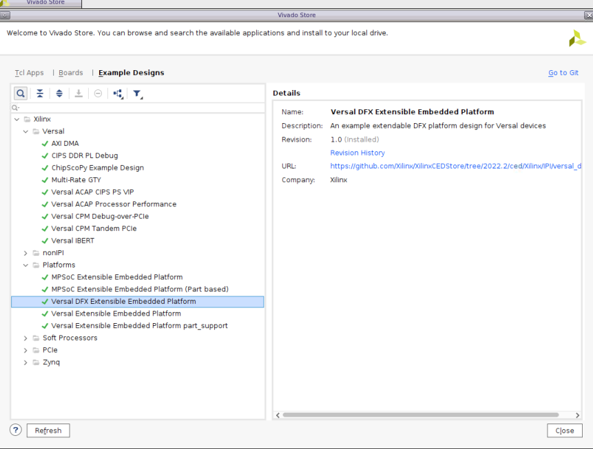
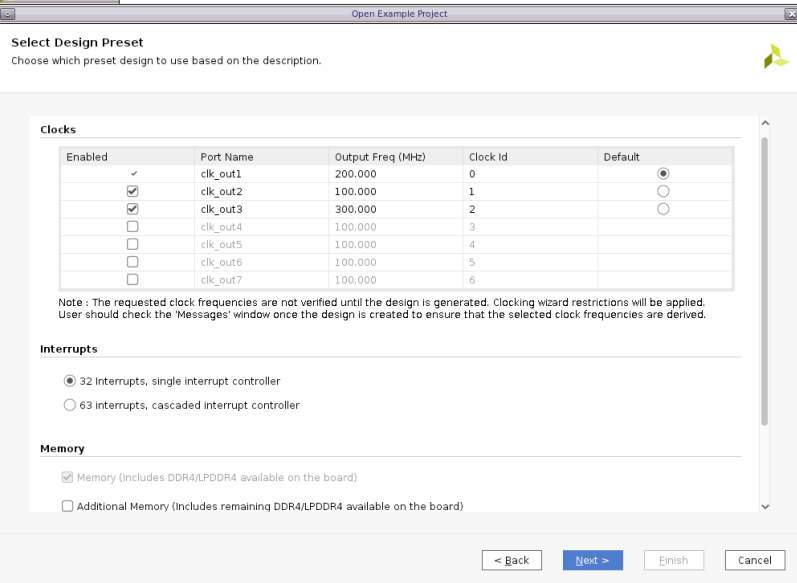
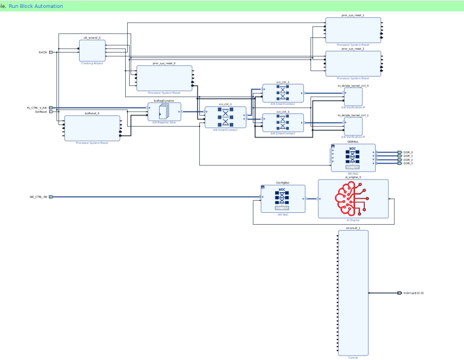

<!-- 
# Copyright 2020 Xilinx Inc.
# 
# Licensed under the Apache License, Version 2.0 (the "License");
# you may not use this file except in compliance with the License.
# You may obtain a copy of the License at
#
#     http://www.apache.org/licenses/LICENSE-2.0
#
# Unless required by applicable law or agreed to in writing, software
# distributed under the License is distributed on an "AS IS" BASIS,
# WITHOUT WARRANTIES OR CONDITIONS OF ANY KIND, either express or implied.
# See the License for the specific language governing permissions and
# limitations under the License.
-->


<table width="100%">
 <tr width="100%">
    <td align="center"><h1>Custom Versal DFX Platform Creation Tutorial</h1>
    </td>
 </tr>
</table>

# Step 1: Create the Hardware Design

The target of this hardware design is to illustrate how to create a DFX hardware platform. We will utilize the Versal DFX Extensible Embedded Example Design. Users can extend the design to fulfill more complex requirements later.

The major differences between the Vitis DFX platform and flat Vitis Platform is the Vivado design. It needs to define the Block Design Container (BDC) for reconfigurable partition. BDC defines the dynamic region, or Reconfigurable Partition (RP). 

Versal devices support partial reconfiguration for almost all component types. Please check [UG909 Vivado Design Suite User Guide: Dynamic Function eXchange](https://docs.xilinx.com/r/en-US/ug909-vivado-partial-reconfiguration/Design-Elements-Inside-Reconfigurable-Modules?tocId=zNU4eeS04V2g~W3rO2mHgA) for more details about the supported element types.

Here are some common practices for partitioning the IPs in Vitis platform designs.

| IP Type                   | Static Region        | Dynamic Region                |
| :------------------------ | :------------------- | :---------------------------- |
| CIPS                      | Y                    |                               |
| AI Engine                 |                      | Y                             |
| Memory                    | Memory Controller    | Export platform interfaces    |
| Clock            | Y                    | Y                             |
| Reset            | Y                    | Y                             |
| Interrupt                 | Interrupt Controller | Export platform interfaces    |
| AXI Master for IP Control |                      | Export platform interfaces    |
| Decoupling for DFX        | DFX Decoupler        | Slice Registers when required |

- **CIPS** has to stay in static region. The hard blocks in CIPS cannot be reconfigured.
- **AI Engine** needs to stay in dynamic region because it requires v++ to link to acceleration kernels during application development phase.
- If the **memory controllers** are shared by static region and dynamic region, like used by ARM processors and acceleration kernels, they should be instantiated to the static region.
- Static region and dynamic region can have their own **clock** generator and **reset** logic. Dynamic region signals can be independent or derived from static region.
- The **Interrupt Controller** is better to be instantiated in static region because we don't wish to reload interrupt controller driver after DFX configuration. Interrupt signals and platform AXI interface signals can be exported from BDC.
- The **decoupling** logics are required on the boundary between static region and dynamic region to help with timing closure and prevent metastability. XRT can turn on DFX Decoupler isolation mode before reconfiguration and turn off isolation after reconfiguration.

We will create the hardware design in Vivado first and then explain the details about the submodule in the CED DFX design.


### Vivado Design Creation

#### Project Creation
1. Create a workspace and Launch Vivado if you haven't

   - mkdir WorkSpace
   - cd WorkSpace
   - Run `source <Vitis_Install_Directory>/settings64.sh` to setup Vivado running environment
   - Run Vivado by typing `vivado` in the console.

2. Download the Versal Extensible Embedded Platform Example
   
   - Click menu **Tools -> Vivado Store..**
   - Click **OK** to agree to download open source examples from web
   - Select **Example Designs -> Platforms -> Versal DFX Extensible Embedded Platform** and click the download button on the tool bar
   - Click **Close** after installation complete.

   

3. Create the Versal DFX Extensible Embedded Platform Example project

   - Click **File -> Project -> Open Example...**
   - Click **Next**
   - Select **Versal DFX Extensible Embedded Platform** in Select Project Template window.
   - Input **project name** and **project location**. Keep **Create project subdirectory** checked. Click **Next**.
   - Select target board in Default Part window. In this example, we use **Versal VCK190 Evaluation Platform** .Click **Next**.
  
   

   - Configure Clocks Settings. You can enable more clocks, update output frequency and define default clock in this view for the staic region. In this example, we can keep the default settings.
   - Configure Interrupt Settings. You can choose how many interrupt should this platform support. 63 interrupts mode will use two AXI_INTC in cascade mode. In this example, we can keep the default setting.
   - Configure Memory Settings. By default, the example design will enable the on board DDR4. If you select the additional on board memories option, you will enable the LPDDR4 on board. 
   - Click **Next**.
   - Review the new project summary and click **Finish**.
   - After a while, you will see the design example has been generated.

   The generated design is like the following:

   
   

   At this stage, the Vivado block automation has already created a top block design and a dynamic region block. It added the CIPS, added a Control, Interface & Processing System (shorten with CIPS in the future), AXI NOC block, dfx_decoupler and all supporting logic blocks to the top diagram and added AI engine, AXI NOC and clock in dynamic region (VitisRegion.bd) and also applied all board presets for the VCK190. Block generation and address aperture setting has also been done. 

   The comming is to explain the sub-module in this CED DFX platform. The sub-module design methdology is applied to all the DFX design.
   
#### DFX Platform Design Submodule Explanation

The following sections provide the platform hardware submodule explanation with diagrams. In the diagrams, Vitis Region is the dynamic area (RP). Blocks out side of Vitis Region are in the static region. They will be loaded at boot time and won't be reconfigured.

##### Memory Subsystem


*Figure 1*

Static region and dynamic region shares the DDR memory. We use the NOC stub in Vitis Region to export memory interface for the platform. V++ linker can connect the PL kernel memory interfaces to the NOC stub to access memory.  

For the interfaces from NOC stub to DDR Memory Controller, we need to setup aperture property so that Vivado can lock the address space assignment.

##### Control Subsystem


*Figure 2*

The control path needs a DFX Decoupler IP. The DFX decoupler can turn off the channels during reconfiguration  to prevent unexpected requests from the static region cause invalid status on AXI interface and prevent random toggles generated by RP reconfiguration cause unexpected side-effects in static region. XRT will turn on DFX decoupler before the reconfiguration process and turn off after the reconfiguration completes. It needs to work with the Register Slice inside Vitis Region to ensure shortest path across the boundary. 

The SmartConnect in Vitis Region can export control interfaces for the platform. V++ linker would connect PL kernel control interface to the SmartConnect.

For the control AXI interface across the boundary, we need to setup aperture property so that Vivado can lock the address space assignment.

##### AI Engine Subsystem


*Figure 3*

CIPS needs to control AI Engine. AI Engine generates a clock which feedback to NOC for the AXI interfaces between NOC and AI Engine.

We create a NOC specific for AI Engine in the Vitis Region. PS_NOC and AIE_NOC communicates with NOC INI.

##### Interrupt Subsystem


*Figure 4*

The platform exports interrupt signals through the concat IP in the Vitis Region. Concat and the interrupt controller in the static region are connected through the DFX_Decoupler IP. Interrupt Controller outputs to CIPS IRQ. 

##### Clock and Reset


*Figure 5*

Static region and dynamic region can have their own clock and reset signals. 

The Clock Wizard in static region is required so that device tree generator (DTG) can generate correct device tree to describe this clock topology.

#### Export Hardware Emulation XSA

The Versal Extensible Platform Example has setup the simulation model of each IP properly. We will review the settings in this session. If you created the block design by yourself, please make sure these settings are applied before running emulation on your platform.

Some blocks in the block design has multiple types of simulation models. Vitis emulation requires these blocks to use SystemC TLM (Transaction-level Modeling) model when available. TLM is the default simulation model for CIPS, NOC and AI Engine. We can review them to make sure they are correct before exporting the hardware.

1. Review CIPS simulation model settings

   - In Vivado GUI, select the CIPS instance
   - Check the ***Block Properties*** window
   - In ***Properties*** tab, it shows **ALLOWED_SIM_MODELS** is `tlm,rtl`, **SELECTED_SIM_MODEL** is `tlm`. It means this block supports two simulation models. We selected to use `tlm` model.

   

2. Review the simulation model property for NOC and AI Engine in the block diagram.


3. Run the following scripts to generate the emulation XSA

   ```tcl
   set_property PREFERRED_SIM_MODEL "tlm" [current_project]
   generate_switch_network_for_noc
   launch_simulation -scripts_only
   launch_simulation -step compile
   launch_simulation -step elaborate
   set_property platform.platform_state "pre_synth" [current_project] # Default Value
   write_hw_platform -hw_emu -file hw_emu/hw_emu.xsa
   ```

#### Export Hardware XSA

1. Run Implementation
   1. Click **Generate Device Image** from Flow Navigator. Wait until the implementation process completes.
   2. Click **Open Implemented Design**

2. Export hardware platform XSA

   Run the following scripts to generate XSA for static region and dynamic region.

   ```tcl
   set_property platform.platform_state "impl" [current_project]
   # Write fixed XSA for static region
   write_hw_platform -force -fixed -static -file vck190_custom_dfx_static.xsa
   # Write extensible XSA for dynamic region
   write_hw_platform -rp versal_dfx_platform_i/VitisRegion vck190_custom_dfx_rp.xsa
   ```

   We export the static region in fixed XSA format and dynamic region in extensible XSA format, because the Vitis v++ linker are suppose only to update the hardware in the dynamic region.

   The fixed XSA for the static region will be used to generate the device tree for the static region.


### Fast Track

Scripts are provided to re-create projects and generate outputs in each step. To use these scripts, please run the following steps

To build the hardware design, please run:

   ```bash
   # cd to the step directory, e.g.
   cd ref_files/step1_hw
   make all
   ```
   
To clean the generated files, please run

   ```bash
   make clean
   ```
  

A top level all in one build script is also provided. To build everything (step 1 to step 4) with one command, please go to ***ref_files*** directory and run

```bash
make all
```

To clean all the generated files, please run

```bash
make clean
```
### Next Step

Now we finish the Hardware platform creation flow. Next we would go to [step 2](./step2.md) to create platform software.
   

## References

https://docs.xilinx.com/r/en-US/ug909-vivado-partial-reconfiguration/Turn-a-Block-Design-Container-into-a-Reconfigurable-Partition
https://docs.xilinx.com/r/en-US/ug909-vivado-partial-reconfiguration/Create-a-Floorplan-for-the-Reconfigurable-Region

<p align="center"><sup>Copyright&copy; 2022 Xilinx</sup></p>
